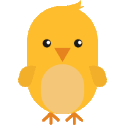

|  | chobo |  |
| --- | --- | --- |
| | A Python package for graphical displays | |

### Welcome

The chobo module is a forked version of the [intrographics](http://myslu.stlawu.edu/~ltorrey/intrographics/) module developed by [Dr. Lisa Torrey](http://myslu.stlawu.edu/~ltorrey/).

It allows you to create graphical displays in your Python 3 programs.
The name chobo (초보) is a Korean word that means a beginner/novice, and the name is to inspire beginners at programming to give it a try.

It is written in [Python 3](https://www.python.org/), and uses the [pygame](https://www.pygame.org/) module as the back-end, and adds the following features:

* Image files other than just GIF
* Arc as a new shape
* An empty image shape
* Shape rotations
* Use of any system fonts
* Sound/music files and their playback

### Installation

The best way to install chobo on your system is by using pip, the Python package management system.

`pip install chobo`

[How to use pip to install packages in PyCharm](https://www.jetbrains.com/help/pycharm/installing-uninstalling-and-upgrading-packages.html)

### Windows

A window is like a drawing canvas. It has a coordinate system with an x-axis and a y-axis whose units are pixels. The point (0,0) is in the top left corner. The x-values increase towards the right, and the y-values increase towards the bottom.

There can be only **ONE** window in your program.

You can create, open, and close a window.

`window = chobo.window(width,height) window.open(title?)`

You can give the window a background color.

`window.fill(color)` (See more about [colors](#Fonts-and-Colors))

You can add geometric shapes to a window.

`rectangle = window.rectangle((x, y), width, height)` (See more about [rectangles](#Rectangles))

`oval = window.oval((x, y), width, height)` (See more about [ovals](#Ovals))

`arc = window.arc((x, y), width, height, beginAngle, arcAngle)` (See more about [arcs](#Arcs))

`polygon = window.polygon((x1, y1), (x2, y2), (x3, y3), ...)` (See more about [polygons](#Polygons))

`line = window.line((x1, y1), (x2, y2), ...)` (See more about [lines](#Lines))

You can compute a position around an oval. (This does not draw the oval.)

`window.ovalPoint((x, y), width, height, angle)` (The angle is in degrees, and measured clockwise from the north direction.)

You can add more complex shapes to a window.

`text = window.text((x, y), message)` (See more about [text](#Text))

`image = window.image((x, y), filename)` (See more about [images](#Images))

`emptyimage = window.emptyimage((x, y), width, height)` (See more about [images](#Images))

You can remove a shape from a window.

`window.remove(shape)`

You can play sound effect in a window.

`soundfx = window.soundfx(filename)` (See more about [soundfx](#Soundfx))

You can play music in a window.

`music = window.music(filename)` (See more about [music](#Music))

You can arrange for functions to be called repeatedly, and to stop being called.

`window.onTimer(milliseconds, function)` (Function must not expect any arguments.)

`window.offTimer(function)`

You can arrange for functions to be triggered by keyboard events, and to stop being triggered.

`window.onKeyPress(function)` (Function must expect one argument (key) indicating which key was pressed.)

`window.offKeyPress(function)`

You can arrange for functions to be triggered by mouse clicks, and to stop being triggered.

`window.onMouseClick(buttonID, function)` (Function must expect two arguments (x, y) indicating where the click occurred.)

`window.offMouseClick(buttonID, function)`

You can arrange for functions to be triggered by mouse dragging, and to stop being triggered.

`window.onMouseDrag(buttonID, function)` (Function should expect arguments (x, y) indicating where the drag occurred.)

`window.offMouseDrag(buttonID, function)`

Some window attributes are accessible (but not assignable).

`window.width` `window.height` (The window dimensions)

### Rectangles

Once you have added a rectangle shape to a window, you can manipulate it as follows.

You can give it a color.

`rectangle.fill(color)` (See more about [colors](#Fonts-and-Colors))

You can change the width or color of its border.

`rectangle.border(width, color)` (See more about [colors](#Fonts-and-Colors))

You can change its location and size.

`rectangle.relocate( (x, y) )` (The shape is relocated to (x, y).)

`rectangle.scale(horizontalScale, verticalScale)` (horizontalScale and verticalScale are in decimal (for example, 0.5 for 50%).)
 
`rectangle.move(dx, dy)` (The shape is moved by displacements specified by dx and dy.)

You can rotate it clockwise (positive angle in degrees) or counterclockwise (negative angle in degrees).

`rectangle.rotate(angle)`

You can ask whether it overlaps with another shape in the window.

`if rectangle.overlaps(shape):`

Some of its attributes are accessible (but not assignable).

`rectangle.width` `rectangle.height` (Dimensions)

`rectangle.left` `rectangle.right` (Boundary x-values)

`rectangle.top` `rectangle.bottom` (Boundary y-values)

### Ovals

Once you have added an oval shape to a window, you can manipulate it as follows.

You can give it a color.

`oval.fill(color)` (See more about [colors](#Fonts-and-Colors))

You can change the width or color of its border.

`oval.border(width, color)` (See more about [colors](#Fonts-and-Colors))

You can change its location and size.

`oval.relocate( (x, y) )` (The shape is relocated to (x, y).)

`oval.scale(horizontalScale, verticalScale)` (horizontalScale and verticalScale are in decimal (for example, 0.5 for 50%).)

`oval.move(dx, dy)` (The shape is moved by displacements specified by dx and dy.)

You can rotate it clockwise (positive angle in degrees) or counterclockwise (negative angle in degrees).

`oval.rotate(angle)`

You can ask whether it overlaps with another shape in the window.

`if oval.overlaps(shape):`

Some of its attributes are accessible (but not assignable).

`oval.width oval.height` (Dimensions of a bounding box)

`oval.left oval.right` (Boundary x-values)

`oval.top oval.bottom` (Boundary y-values)

### Polygons

Once you have added a polygon shape to a window, you can manipulate it as follows.

You can give it a color.

`polygon.fill(color)` (See more about [colors](#Fonts-and-Colors))

You can change the width or color of its border.

`polygon.border(width, color)` (See more about [colors](#Fonts-and-Colors))

You can change its location and size.

`polygon.relocate( (x, y) )` (The shape is relocated to (x, y).)

`polygon.scale(horizontalScale, verticalScale)` (horizontalScale and verticalScale are in decimal (for example, 0.5 for 50%).)

`polygon.move(dx, dy)` (The shape is moved by displacements specified by dx and dy.)

You can rotate it clockwise (positive angle in degrees) or counterclockwise (negative angle in degrees).

`polygon.rotate(angle)`

You can ask whether it overlaps with another shape in the window.

`if polygon.overlaps(shape):`

Some of its attributes are accessible (but not assignable).

`polygon.width` `polygon.height` (Dimensions of a bounding box)
`polygon.left` `polygon.right` (Boundary x-values)
`polygon.top` `polygon.bottom` (Boundary y-values)

### Lines

Once you have added a line shape to a window, you can manipulate it as follows.

You can change its color and width.

`line.fill(color)` (See more about [colors](#Fonts-and-Colors))

`line.border(width)`

You can change its location.

`line.relocate( (x, y) )` (The shape is relocated to (x, y).)

`line.scale(horizontalScale, verticalScale)` (horizontalScale and verticalScale are in decimal (for example, 0.5 for 50%).)

`line.move(dx, dy)` (The shape is moved by displacements specified by dx and dy.)

You can rotate it clockwise (positive angle in degrees) or counterclockwise (negative angle in degrees).

`line.rotate(angle)`

You can ask whether it overlaps with another shape in the window.

`if line.overlaps(shape):`

Some of its attributes are accessible (but not assignable).

`line.width` `line.height` (Dimensions of a bounding box)

`line.left` `line.right` (Boundary x-values)

`line.top` `line.bottom` (Boundary y-values)

### Text

Once you have added text to a window, you can manipulate it as follows.

You can change its font, size, and color.

`text.format(font, size, color)` (See more about [fonts and colors](#Fonts-and-Colors))

You can change its location.

`text.relocate( (x, y) )`  (The shape is relocated to (x, y).)

`text.move(dx, dy)` (The shape is moved by displacements specified by dx and dy.)

You can read and change its contents.

`message = text.read(datatype)` (It parses the message of the text shape as the given data type (`int`, `str`, etc.).)

`text.rewrite(message)` (It changes the message of the text shape.)

You can ask whether it overlaps with another shape in the window.

`if text.overlaps(shape):`

Some of its attributes are accessible (but not assignable).

`text.width` `text.height` (Dimensions)

`text.left` `text.right` (Boundary x-values)

`text.top` `text.bottom` (Boundary y-values)

### Images

Images have internal coordinate systems just like windows. The top left corner is column 0, row 0. Pixel x-values increase towards the right, and pixel y-values increase towards the bottom.

You can inspect or change the color at a particular pixel in the image.

`(r,g,b) = image.getColor( (x, y) )`

`image.setColor( (x, y), color)`  (See more about [colors](#Fonts-and-Colors))

You can change the location of an image within the window.

`image.relocate( (x, y) )` (The shape is relocated to (x, y).)

`image.move(dx, dy)` (The shape is moved by displacements specified by dx and dy.)

You can rotate it clockwise (positive angle in degrees) or counterclockwise (negative angle in degrees).

`image.rotate(angle)`

You can ask whether it overlaps with another shape in the window.

`if image.overlaps(shape):`

You can save an image to a new file.

`image.saveAs(filename)`

Some image attributes are accessible (but not assignable).

`image.width` `image.height` (Dimensions)

`image.left` `image.right` (Boundary x-values)

`image.top` `image.bottom` (Boundary y-values)

### SoundFX

Once you have added a sound effect to a window, you can manipulate it as follows.

You can play the sound effect.

`soundfx.play()` 

### Music

Once you have added music to a window, you can manipulate it as follows.

You can play the music. NOTE: You can only play one music file at a time. If you play different music while playing another, the previously playing music will stop, and the new one will play.

`music.play()`

You can stop the music.

`music.stop()`

You can pause the music. 

`music.pause()` (If you play another music while this music is paused, the paused position will be lost and you need to use play (not unpause) this music from the beginning again.)

You can unpause/resume the music.

`music.unpause()` (Unpausing music only works if you have not played another music while paused.)

You can check if the music is playing (`True` or `False`).

`music.isPlaying()`

You can get the volume (0.0 mute, 1.0 loudest) of the music.

`music.getVolume()`

You can set the volume  (0.0 mute, 1.0 loudest) of the music.

`music.setVolume(volume)` 

### Fonts and colors

Different fonts many be available on different computers, but these three are guaranteed:

`Helvetica`
`Courier`
`Times`

Any color can be constructed in RGB format:

`color = (r, g, b)`

[HTML Color Codes](https://htmlcolorcodes.com/) website can help you find out the amounts of red, green, and blue for the color of your choice visually.
